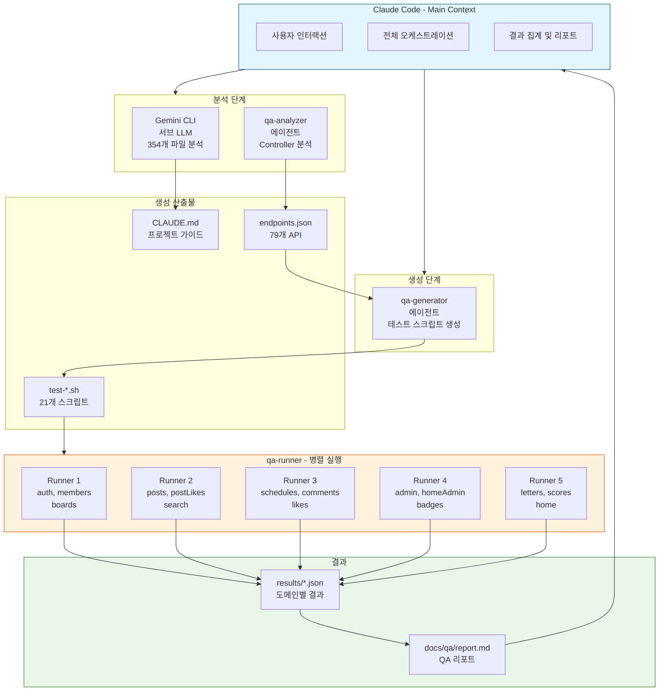
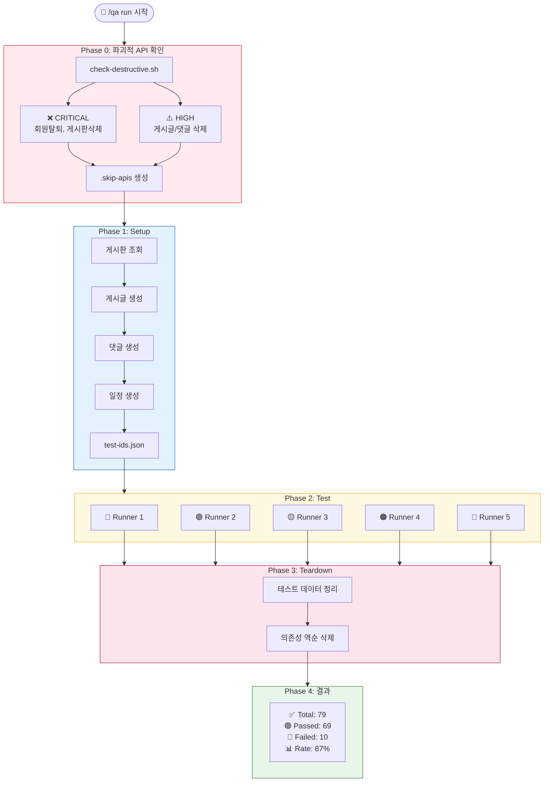
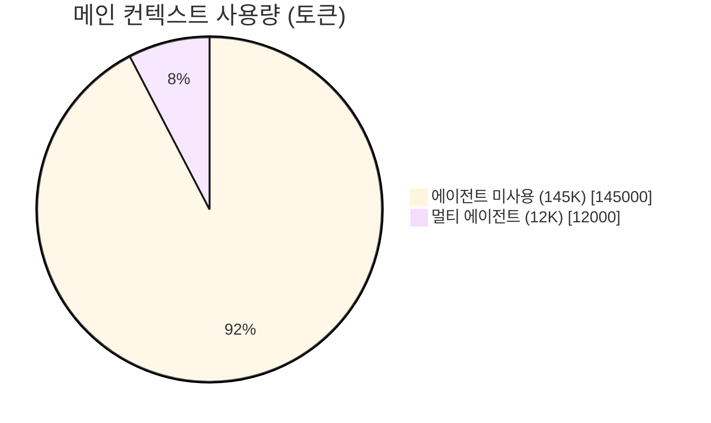
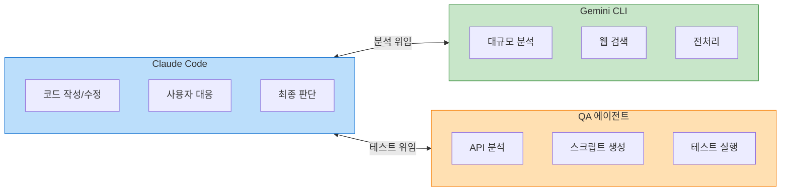

# QA 멀티 에이전트 아키텍처 다이어그램

## 1. 전체 시스템 아키텍처

```mermaid
flowchart TB
    subgraph Main["Claude Code - Main Context"]
        direction TB
        M1["사용자 인터랙션"]
        M2["전체 오케스트레이션"]
        M3["결과 집계 및 리포트"]
    end

    subgraph Analysis["분석 단계"]
        direction TB
        G["Gemini CLI<br/>서브 LLM<br/>354개 파일 분석"]
        A["qa-analyzer<br/>에이전트<br/>Controller 분석"]
    end

    subgraph Generation["생성 단계"]
        GEN["qa-generator<br/>에이전트<br/>테스트 스크립트 생성"]
    end

    subgraph Artifacts["생성 산출물"]
        direction LR
        CLAUDE["CLAUDE.md<br/>프로젝트 가이드"]
        ENDPOINTS["endpoints.json<br/>79개 API"]
        SCRIPTS["test-*.sh<br/>21개 스크립트"]
    end

    subgraph Runners["qa-runner - 병렬 실행"]
        direction LR
        R1["Runner 1<br/>auth, members<br/>boards"]
        R2["Runner 2<br/>posts, postLikes<br/>search"]
        R3["Runner 3<br/>schedules, comments<br/>likes"]
        R4["Runner 4<br/>admin, homeAdmin<br/>badges"]
        R5["Runner 5<br/>letters, scores<br/>home"]
    end

    subgraph Results["결과"]
        direction TB
        JSON["results/*.json<br/>도메인별 결과"]
        REPORT["docs/qa/report.md<br/>QA 리포트"]
    end

    Main --> Analysis
    Main --> Generation
    G --> CLAUDE
    A --> ENDPOINTS
    ENDPOINTS --> GEN
    GEN --> SCRIPTS
    SCRIPTS --> Runners
    R1 --> JSON
    R2 --> JSON
    R3 --> JSON
    R4 --> JSON
    R5 --> JSON
    JSON --> REPORT
    REPORT --> Main

    style Main fill:#e1f5fe,stroke:#01579b
    style Runners fill:#fff3e0,stroke:#e65100
    style Results fill:#e8f5e9,stroke:#2e7d32
```

## 2. /qa run 실행 흐름

```mermaid
flowchart TD
    START(["🚀 /qa run 시작"])

    subgraph Phase0["Phase 0: 파괴적 API 확인"]
        P0["check-destructive.sh"]
        CRITICAL["❌ CRITICAL<br/>회원탈퇴, 게시판삭제"]
        HIGH["⚠️ HIGH<br/>게시글/댓글 삭제"]
        SKIP[".skip-apis 생성"]
    end

    subgraph Phase1["Phase 1: Setup"]
        S1["게시판 조회"]
        S2["게시글 생성"]
        S3["댓글 생성"]
        S4["일정 생성"]
        IDS["test-ids.json"]
    end

    subgraph Phase2["Phase 2: Test"]
        direction LR
        T1["🔵 Runner 1"]
        T2["🟢 Runner 2"]
        T3["🟡 Runner 3"]
        T4["🟠 Runner 4"]
        T5["🔴 Runner 5"]
    end

    subgraph Phase3["Phase 3: Teardown"]
        D1["테스트 데이터 정리"]
        D2["의존성 역순 삭제"]
    end

    subgraph Phase4["Phase 4: 결과"]
        RESULT["✅ Total: 79<br/>🟢 Passed: 69<br/>🔴 Failed: 10<br/>📊 Rate: 87%"]
    end

    START --> Phase0
    P0 --> CRITICAL
    P0 --> HIGH
    CRITICAL --> SKIP
    HIGH --> SKIP
    SKIP --> Phase1

    S1 --> S2 --> S3 --> S4 --> IDS
    IDS --> Phase2

    T1 & T2 & T3 & T4 & T5 --> Phase3

    D1 --> D2
    D2 --> Phase4

    style Phase0 fill:#ffebee,stroke:#c62828
    style Phase1 fill:#e3f2fd,stroke:#1565c0
    style Phase2 fill:#fff8e1,stroke:#f9a825
    style Phase3 fill:#fce4ec,stroke:#ad1457
    style Phase4 fill:#e8f5e9,stroke:#2e7d32
```

## 3. 컨텍스트 효율성 비교

```mermaid
%%{init: {'theme': 'base'}}%%
pie showData
    title 메인 컨텍스트 사용량 (토큰)
    "에이전트 미사용 (145K)" : 145000
    "멀티 에이전트 (12K)" : 12000
```

## 4. 에이전트 역할 분담

```mermaid
graph LR
    subgraph Claude["Claude Code"]
        C1["코드 작성/수정"]
        C2["사용자 대응"]
        C3["최종 판단"]
    end

    subgraph Gemini["Gemini CLI"]
        G1["대규모 분석"]
        G2["웹 검색"]
        G3["전처리"]
    end

    subgraph QA["QA 에이전트"]
        Q1["API 분석"]
        Q2["스크립트 생성"]
        Q3["테스트 실행"]
    end

    Claude <-->|"분석 위임"| Gemini
    Claude <-->|"테스트 위임"| QA

    style Claude fill:#bbdefb,stroke:#1976d2
    style Gemini fill:#c8e6c9,stroke:#388e3c
    style QA fill:#ffe0b2,stroke:#f57c00
```
